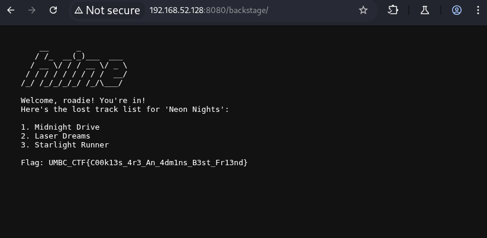

# Mixtape Challenge: Backstage Pass

This repository contains the source code and deployment files for a simple web-based Capture The Flag (CTF) challenge involving cookie manipulation.

### Overview

The challenge presents players with a fan club website for a fictional synth-wave band. The goal is to bypass a fake login on a hidden "backstage" page to retrieve a flag. The vulnerability lies in an insecure, client-side cookie used for access control.

### How to Deploy

This challenge is containerized using Docker for easy deployment.

1.  **Prerequisites:** Docker and Docker Compose must be installed.
2.  **Clone the Repository:** `git clone https://github.com/YourUsername/mixtape-challenge.git`
3.  **Run the Container:**
    ```bash
    cd mixtape-challenge
    docker-compose up --build -d
    ```
4.  The challenge will be accessible at `http://localhost:8080`.

---

## Challenge Write-up & Solution

**URL:** `http://<TARGET_IP>:8080`

### Step 1: Network Reconnaissance with Nmap

**Purpose:** Identify open ports and services on the target server.

.

**Command:**
```bash
nmap -A -p- <TARGET_IP>
-A: Aggressive scan (OS detection, version detection, script scanning).

-p-: Scan all 65,535 TCP ports.

Expected Output & Interpretation: The scan confirms that port 8080 is open and running an Apache HTTP server, identifying it as our primary target.

Step 2: Web Content Discovery with Gobuster
Purpose: Enumerate hidden directories and files on the web server.

Command:

Bash

gobuster dir -u http://<TARGET_IP>:8080 -w /usr/share/wordlists/dirbuster/directory-list-2.3-medium.txt
gobuster dir: Specifies directory enumeration mode.

-u <URL>: Sets the target URL.

-w <WORDLIST>: Specifies the wordlist to use.

Interpretation: Gobuster will discover /admin_panel (a decoy) and /backstage (the real challenge).

Step 3: Interception and Cookie Manipulation
Purpose: Intercept and modify HTTP requests to exploit client-side vulnerabilities. The easiest method is using browser developer tools.

Navigate to http://<TARGET_IP>:8080/backstage/.

Open Developer Tools (F12).

Go to the "Application" tab (Chrome) or "Storage" tab (Firefox).

Expand the "Cookies" section.

Locate the access_level cookie and change its value from guest to admin.

Step 4: Capture the Flag
After modifying the cookie, refresh the browser page. The server will now grant you access, and the flag will be displayed.

Final Output:

Flag: UMBC_CTF{C00k13s_4r3_An_4dm1ns_B3st_Fr13nd}

---

### **Part 3: Deploying from GitHub**

GitHub itself is a code hosting platform, not a server to run applications. You cannot "run" the Docker container *on* `github.com`. Instead, you use GitHub as the central source of your code, and you deploy that code to a server.

The most common and practical method for this is the **"Manual Git Pull on a Server"** workflow.

**Prerequisites:**
* A server (e.g., a DigitalOcean Droplet, AWS EC2 instance, or any Linux VM) with Docker and Docker Compose installed.

**Step-by-step Deployment:**

1.  **SSH into Your Server:**
    ```bash
    ssh user@your_server_ip
    ```

2.  **Install Git (if not already installed):**
    ```bash
    sudo apt update
    sudo apt install git -y
    ```

3.  **Clone Your Repository from GitHub:**
    This command downloads a copy of your challenge code from GitHub onto your server.
    ```bash
    git clone https://github.com/YourUsername/mixtape-challenge.git
    ```

4.  **Navigate into the Project Directory:**
    ```bash
    cd mixtape-challenge
    ```

5.  **Build and Run with Docker Compose:**
    This command reads your `docker-compose.yml` and `Dockerfile`, then builds and starts the container.
    ```bash
    docker-compose up --build -d
    ```

Your challenge is now live and running on `http://your_server_ip:8080`!

**How to Update the Challenge:**
If you make changes to your code and push them to GitHub, you can easily update the running application on your server:

```bash
# Navigate to the project directory on your server
cd mixtape-challenge

# Pull the latest changes from the 'main' branch on GitHub
git pull origin main

# Re-build and restart the container with the new code
docker-compose up --build -d
